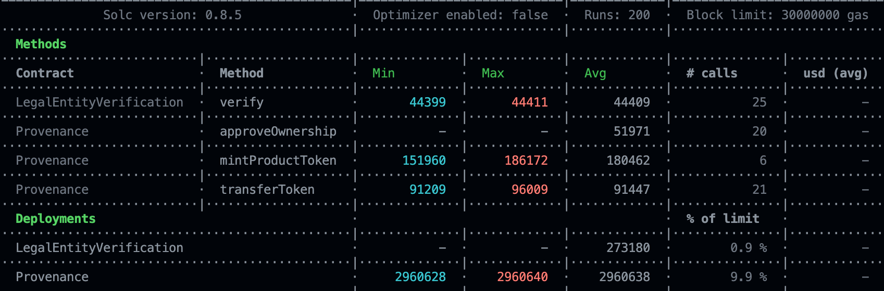

# CMPE483, Provenance Project, Fall 2021
In this project, we developed two smart contracts based on ERC721 token.

## Legal Entity Verification Contract
First contract is [LegalEntityVerification.sol](./contracts/LegalEntityVerification.sol) for State. 

This contract has the following modifiers:
- `onlyStateAuthority(address _address)`: Allows only state authority to perform actions.
- `onlyNonVerified(address _address)`: Allows only non-verified address to be performed on.

This contract has the following fields:
- `mapping(address=>bool) verifiedAddresses` : This mapping returns true or false based on if given address is verified or not.
- `address public stateAuthority` : Address of the state, it's public since all manufacturers have to know and access that.

This contract has the following functions:
- `verify(address _address)` : A `void` function. If `msg.sender` is the state address and given `_address` is not verified before, maps `_address` as `true` in `verifiedAddresses`.
- `isVerified(address _address)` : If `_address` is verified before, returns `true`. Else, returns `false`.

## Provenance Contract
Second contract is [Provenance.sol](./contracts/Provenance.sol). 

This contract has the following modifers:
- `onlyVerifiedAddress(address _address)`: Only addresses that are verified by the state authority(see [LegalEntityVerification.sol](./contracts/LegalEntityVerification.sol)) can perform actions.
- `onlyExistentToken(uint256 _tokenId)` : Only tokens that are in circulation(or minted we can say) can be subject to actions. 
- `onlyNonApprovedToken(uint256 _tokenId)`: Only tokens that are in the approval state can be subject to actions.
- `onlyAuthorized(address _address)`: Only authorized(in this case the `factory`) can perform actions.
- `onlyOwner(uint256 _tokenId,address _address)`:Only the owner of the token can perform actions. 

This contract has the following fields:
-  `uint256 public serialId` : Serial Product id. Starts with 0. Increments by one in every mint.
-  `address public factory` : Address of the factory.
-  `address public legalEntityContractAddress` : Address of state contract.
-  `mapping(uint256=>address[]) owners` : holds information of all owners' addresses in order. First owner's address is `owners[0]`.
-  `mapping(uint256=>Product) products` : Holds the information about the product. When we mint a token, we are mapping an instance of the `Product` struct to have more information about the product.
- `mapping(uint256=>bool) approvalState;`: Holds the information about the approval state of the queried token.

This contract has the following functions: 
- `mintProductToken(uint256 _zipCode)` : If address is authorized by state, mints the token by using _safeMint(msg.sender,productId) function of ERC721. Adds the factory address to the owners, and increments serialID by one.
- `getTheOriginAddress(uint256 _tokenId)` : Returns the first owner of that token.
- `approveOwnership(uint256 _tokenId)` : When we transfer a token, maybe the receiver might not be aware that a token is sended to her. In depth, she might not even want to own the token, so we have to provide a solution for the receiver that she will approve or not approve the ownership of the token whenever she is aware of the transaction.
- `transferToken(address _from,address _to, uint256 _tokenId)` : Transfers the token which has given `tokenId` by using  `_transfer(_from,_to,_tokenId)` function of ERC721.

### Commons in Contracts
There are several getters for easier access to fields or mapped values in both functions. We are not going to crowd this file with them since they are self-explaining and the comments in the code will clear any confusions.


## Example Workflow
A simple flow happens as follow:

- The state contract is initiated.
- Provenance contracts are initiated with the address of the state contract deployed.
- Tokens are minted by `mintProductToken` function.
- Tokens can be transferred by `transferToken` function.
- If receiver accepts the transferred token, she approves the ownership with `approveOwnership` function and she becomes the new owner of the token. Else, the token's ownership history will not show the latest address who received the token.

## Usage
We used [Hardhat](https://hardhat.org/) in this project for testing and deploying to `Rinkeby`.We have manually deployed to `AVA Fuji Testnet` as the final network for the task. The contract addresses are at the end of the file.

First install the required dependencies by running:
```
npm install 
```

For running the tests:
```
npx hardhat test
```

When you run the tests, you can see how much gas do the functions spend in the table as:


For deploying to any network:
- You have to first specify the network you want to deploy and configure the `hardhat.config.js` file for your needs. This project configured it's network to `Rinkeby`, and using [Infura](https://infura.io/) as provider.
- You have to put your mnemonic seed and `Infura` URL to an `.env` file,provided as empty fields in the repository. Without those requirements fulfilled, the deploying process will yield errors.
After completing the steps, you can deploy the contracts to the network with the command:
```
npx hardhat run ./scripts/deploy.js --network <YOUR_NETWORK_NAME>
```


## AVA Fuji Testnet Contract Addresses
- `LegalEntityVerification.sol`:(0x13D53a1F78A4E65182A9d19b68C75a41d0d8955b)[https://testnet.snowtrace.io/address/0x13d53a1f78a4e65182a9d19b68c75a41d0d8955b]
- `Provenance.sol`:(0xdF1A9cc4E2869278c12851dC3De27Acf9E6D63c3)[https://testnet.snowtrace.io/address/0xdf1a9cc4e2869278c12851dc3de27acf9e6d63c3]

# Q&A:
 - How to ensure there is only one state? : We pass the address of the deployed state authority to the Provenance constructor, meaning that only state we will listen is the one with given address.
 - How to ensure no token has two owners at the same time? : ERC721 handles it.


# Authors
 - Doğukan Türksoy [@ooodogodogodogo](www.github.com/ooodogodogodogo)
 - Deniz Sürmeli   [@denizvsurmeli](www.github.com/denizvsurmeli)